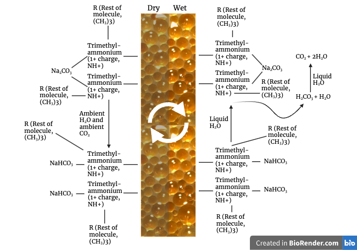
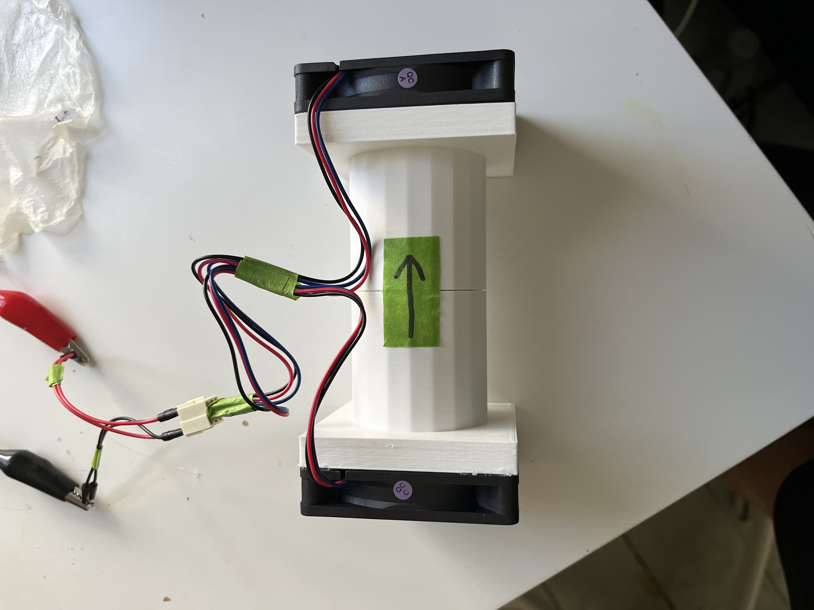

# Carbon Capture

## Introduction

TL;DR: I built a novel, small scale, carbon capture machine, and wrote a [paper](https://docs.google.com/document/d/18p59EmKheP8YZRrSHv7kxILEd36yUNC7U6RdwxdAVec/edit?usp=sharing).

Carbon capture is the process of removing CO₂ from the atmosphere, often using machines like Direct Air Capture (DAC) scrubbers. While reducing our carbon footprint remains critical, climate models indicate that carbon capture is essential to maintain environmental stability.

This project explores a proof-of-concept system that desorbs CO₂ using water, employing a moisture swing system. Currently, the capturing process occurs in a fan chamber, but future iterations aim to integrate both capturing and desorption into a single system. It’s worth noting that this prototype does not sequester CO₂; instead, it absorbs and desorbs CO₂, which is released back into the atmosphere during testing.

This project also includes resources that are applicable to other machines, like [calculators for CO₂ sequestered](Code/README.md). 

 | 
-- | --
<i>Chemistry behind the madness. Created with Biorender.</i> | <i>Prototype device.</i>

## Status: Deprecated

This project is no longer under active research but remains accessible for educational purposes. If you're interested in understanding why the project ended, you can read the [bottom of this page](#was-this-project-a-success).

Additionally, I published a paper detailing this project, available here: [**read the paper**](https://docs.google.com/document/d/18p59EmKheP8YZRrSHv7kxILEd36yUNC7U6RdwxdAVec/edit?usp=sharing).

## Table of Contents

* [Before You Start...](#how-to-get-started)
* [How Does Carbon Capture Work?](#how-it-works)
* [Data Analysis/Quantification](#data-analysisquantification)
* [Further Learning](#further-learning)
* [Was This Project a Success?](#was-this-project-a-success)
* [Materials](materials.md)
* [Test Chambers](Test%20ChambersREADME.md)
  * [Test Chamber MK1](Test%20Chamberstest-chamber-mk1.md)
  * [Test Chamber MK2](Test%20Chamberstest-chamber-mk2.md)
  * [Test Chamber MK3](Test%20Chamberstest-chamber-mk3.md)
* [Sorbent Prep](Sorbent%20Prep/README.md)
  * [Sorbent #1 Prep](Sorbent%20Prep/sorbent-1-prep.md)
  * [Sorbent #2 Prep](Sorbent%20Prep/sorbent-2-prep.md)
* [Tests](Tests/README.md)
  * [Test #1 with Sorbent #1](Tests/test-1-with-sorbent-1.md)
  * [Test #2 with Sorbent #1](Tests/test-2-with-sorbent-1.md)
  * [Test #3 with Sorbent #1](Tests/test-3-with-sorbent-1.md)
  * [Test #4 with Sorbent #1](Tests/test-4-with-sorbent-1.md)
  * [Test #5 with Sorbent #1](Tests/test-5-with-sorbent-1.md)
  * [Test #6 with Sorbent #1](Tests/test-6-with-sorbent-1.md)
  * [Test #7 with Sorbent #1](Tests/test-7-with-sorbent-1.md)
  * [Test #8 with Sorbent #2](Tests/test-8-with-sorbent-2.md)

## How to Get Started

So, you want to make your own CDR machine? Before diving into the other sections, make sure you've read through this page. To get the most out of this project and its respective guides, I highly recommend exploring a few of the resources below. If you're short on time, start with the interactive or the video — they’re great for quickly understanding the need for carbon dioxide removal (CDR) and clarifying the differences between its various types.

The next step after getting educated is to start building. Once you're commited, you should start to purchase the items in the [materials](materials.md) page. Then, you should start out by making your sorbent, and then make your chamber. Both have guides in this repository.

This project primarily focuses on **moisture swing absorption** as a method of carbon capture, so it’s a bit niche and may feel biased toward this approach.  

Good luck, and happy building!

### Suggested Resources

1. **Comprehensive Article**  
   A detailed, in-depth read: [Read the CDR Primer](https://cdrprimer.org/read)
2. **Fact Sheet**  
   A concise overview: [Carbon Dioxide Removal Fact Sheet](https://www.energy.gov/sites/default/files/2021-11/Carbon-Dioxide-Removal-FactSheet.pdf)
3. **Interactive Animation**  
   Explore how moisture swing carbon capture works: [What is Direct Air Capture?](https://openaircollective.cc/what-is-dacc/)
4. **Short Video**  
   A ten-minute explainer that clears up confusion about all things CDR: [Watch on YouTube](https://www.youtube.com/watch?v=0wT10LDwe64)

## How It Works

The system utilizes **ion exchange resin**, treated with chemicals like sodium carbonate, to capture and release CO₂. Here’s how:

1. **Capture:** The resin spontaneously absorbs CO₂ from the atmosphere.
2. **Release:** The CO₂ is desorbed using only liquid water — a process known as a **moisture swing system**.

### Why Releasing CO₂ Matters

* **Product Utilization:** The released CO₂ can be converted into high-value products such as carbon fiber, nanotubes, or stored underground in basalt formations.
* **Sorbent Reusability:** Reusing the resin reduces both cost and environmental impact. Unlike traditional sorbents such as zeolites or calcium carbonate, which require significant heat (up to 500°C) for regeneration, this system requires only water, making it more energy-efficient and sustainable.

### Research Basis

This project builds on research conducted by Professor Tao Wang and Professor Klaus Lackner, particularly the study:  
Wang, Tao, et al. “Moisture Swing Sorbent for Carbon Dioxide Capture From Ambient Air.”  
_Environmental Science & Technology_, vol. 45, no. 15, American Chemical Society, July 2011, pp. 6670–75, doi:10.1021/es201180v. **You may hear me refering to this as "the study."**

## Key Terms

Throughout this project, the terms "sorbent," "ion exchange resin," "anion resin," "resin," and "sorbent material" are used interchangeably.

## Data Analysis/Quantification

To learn how much carbon dioxide you captured, use this [script](Code/README.md#carbon-removal-calculator).

To create graphs from the CO₂ sensor, follow this [simple guide](Code/README.md#anaylsis) that I made.

## Further Learning

Some of these links have already been scattered around, but I'm working on putting all of them here. Or I will at some point.

You should definitely **[check out OpenAir](www.openaircollective.cc)**! They have so many great resources including a carbon capture Discord server and carbon capture forum. They also run challenges and are just a great resource for learning everything about carbon capture.

* Learn how ion exchange works: [https://www.lenntech.com/Data-sheets/Ion-Exchange-for-Dummies-RH.pdf](https://www.lenntech.com/Data-sheets/Ion-Exchange-for-Dummies-RH.pdf).
* OpenAir is a community of CDR enthusiasts and volunteers with a large number of projects and large amounts of expertise: [https://openaircollective.cc/](https://openaircollective.cc/).
* BTW, you can access most scholarly articles for free with Sci-Hub, if you find anything that interests you: [https://sci-hub.se/](https://sci-hub.se/).
* Original study: [https://sci-hub.se/10.1021/es201180v](https://sci-hub.se/10.1021/es201180v).
* Studies with some more stuff and more clearing up on how it works: [https://sci-hub.se/10.1371/journal.pone.0179828](https://sci-hub.se/10.1371/journal.pone.0179828) and [https://sci-hub.se/10.1002/ange.201507846](https://sci-hub.se/10.1002/ange.201507846) (I recommend reading these).
* A fun animation of moisture swing absorption: [https://openaircollective.cc/what-is-dacc/](https://openaircollective.cc/what-is-dacc/).
* A whole other **page of resources**: [https://openaircollective.cc/resources/](https://openaircollective.cc/resources/).
* Here is the paper I wrote on my project: [https://docs.google.com/document/d/18p59EmKheP8YZRrSHv7kxILEd36yUNC7U6RdwxdAVec/edit?usp=sharing](https://docs.google.com/document/d/18p59EmKheP8YZRrSHv7kxILEd36yUNC7U6RdwxdAVec/edit?usp=sharing).

## Was This Project a Success?

This project has been in the works for over 2 years, and it has started slowing down. Would I call it a success? Yes. Yes, in the sense that I learned lots about chemistry and doing projects. No, otherwise. Let me explain.

Pertaining to the numbers, my project wasn't a success. I blame the lack of proper lab, primarily.

A valuable lesson that I learned is that it's hard to replicate the work of famous scientists (with massive laboratories and massive budgets) in your bedroom. I'm not saying it's not possible; my carbon capture machine worked, just not at a level that could make any change. And I did the math, too. I found out that even with the most efficient machine possible, you would need a gargantuan number of machines to make an impact. Again, I'm not saying that carbon capture is not possible and is not needed (it is), but it made me think. It made me think that carbon capture is not something that comes swooping in, saving us from climate apocalypse. It isn't a crutch; it's the finale in our carbon emission reductions. We can't rely too heavily on it, and we cannot act like it is our crutch.

Is this project worth it for you? It depends on the person, but this is more of a learning journey than anything else. Are you looking to learn more about chemistry, physics, and the viability of carbon capture? Then go ahead, this is for you. Are you a genius who wouldn't learn anything while doing this? Then maybe this isn't for you. I'm 100% not shooting down your dreams. If you're serious about this, I beg you to get access to a real lab and become a researcher. Develop the machines of the future!

Because of what I've just said, I've decided to move on to more tangible research that can tackle our world's plastic problem and lower our CO₂ emissions at the same time, bioplastic. This isn't the end of carbon capture for me. I hope to someday continue this in college or as an internship. Furthermore, all my projects in the future will have a part, whether large or small, about CO₂ reduction because I've learned just how important it is.

Best of luck to you.