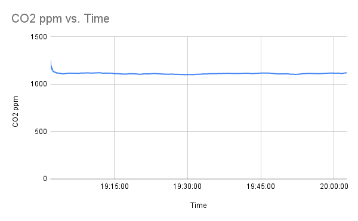
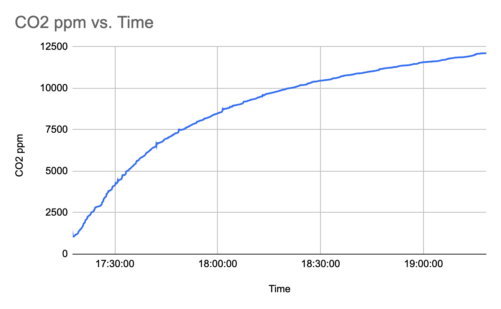
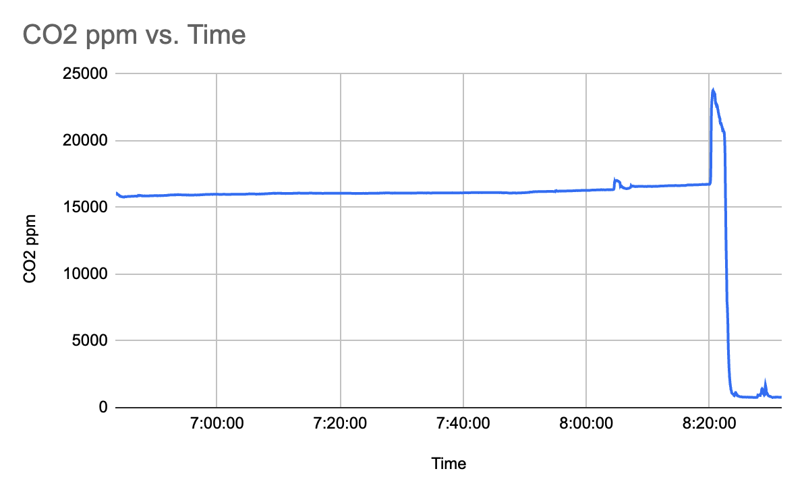
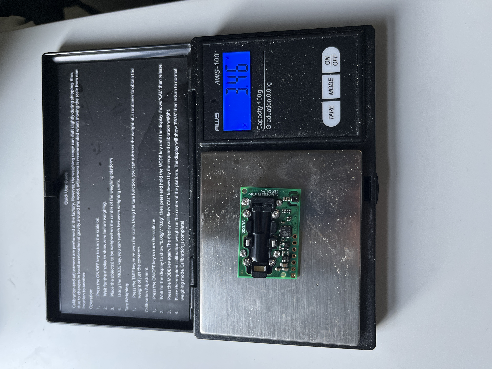

# Test Chamber MK2  

For the MK2 test chamber, I used an **IP67 waterproof storage container** from Home Depot and upgraded to a more accurate CO2 sensor, the **SCD30**. This sensor uses NDIR (Non-Dispersive Infrared) technology, making it far more precise than the MOX sensor used in the previous version.  

To modify the container, I drilled two holes:
* One for water (to regenerate the resin).
* One for wires to connect the CO2 sensor.  

I sealed these holes with hot glue to ensure the chamber remained airtight.  

## Important Note

Before continuing, be sure to review this note and the **MK3 chamber page** for additional insights!  

I initially used an **Arduino Leonardo** for the setup, but it had compatibility issues with the SCD30 sensor. I then tried the **Arduino Nano**, which also didn’t work. Ultimately, the **Arduino Uno** worked flawlessly, so I recommend using it if you’re replicating this setup.  

## Setup Overview  

### Materials

- **IP67 waterproof storage container** ($15): [Home Depot Link](https://www.homedepot.com/p/Ezy-Storage-18L-19Qt-Waterproof-Clear-Latch-Tote-IP-67-FBA34060/314650516)  
- **SCD30 sensor** ($35 on Amazon, $60 on Adafruit)  
- **Arduino Uno** ($10 on Amazon)  
- Wires ($1)  
- USB cable for Arduino ($2)  
- Breadboard ($2)  
- Hot glue gun and glue sticks  
- Drill with various-sized bits  
- Thin tubing ($1)  
- 10-50 mL syringe ($1)  

### Build Instructions:  
1. Create the SCD30 circuit following the [Adafruit tutorial](https://learn.adafruit.com/adafruit-scd30).  
   * If not using the Adafruit sensor, add an **I2C shift register** for compatibility with 5V Arduinos.  
2. Drill two holes on opposite sides of the box, about 1-2 inches above the base.  
   * Thread wires through one hole and connect them to the sensor.  
   * Insert tubing through the other hole, leaving a minimal amount protruding inside the box.  
3. Seal both holes with hot glue to ensure an airtight chamber.  
4. Place the sensor in the center of the chamber.  
5. Add a Petri dish or similar container beneath the syringe hole to catch water and hold the resin.  
6. Mount the Arduino outside the box and connect it to the sensor.  
7. Test the setup by running the Arduino code provided in the Adafruit tutorial or the **data quantification section** of this guide.  
8. Done!  

## Results  

### Initial Setup

The Arduino Uno was connected to the SCD30 sensor, with data printed to the serial monitor. I copied this data into Google Sheets to generate the following graphs:  

  
This graph demonstrates stable CO2 readings over an hour, confirming the chamber is airtight and the measuring apparatus is reliable.  

### Club Soda Experiment: 

To further test the chamber, I placed an open bottle of club soda inside.  

1. **Day 1:**  
     
   This graph shows a steady increase in CO2 levels as the club soda released gas.  
2. **Day 2:**  
     
   CO2 levels continued to rise overnight, confirming the chamber’s hermetic seal. The spike at the end occurred when I opened the chamber.  

## Images  

- **SCD30 Sensor:**  
    
  The SCD30 sensor weighs just 3.46 grams.  
- **Complete Setup:**  
    
- **Wiring Close-Up:**  
    
  Follow the Adafruit tutorial for wiring details.