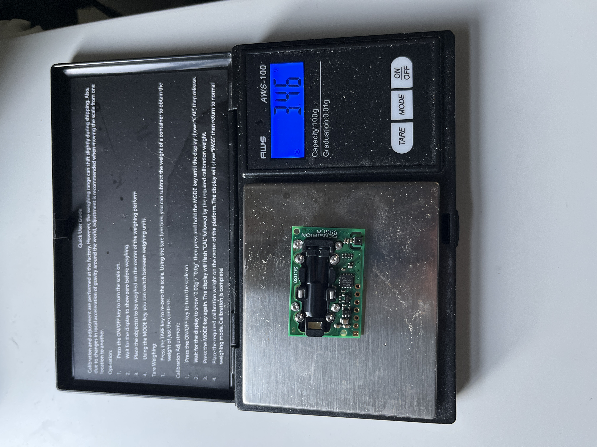

# Test Chamber MK2

I used an IP67 waterproof storage container from Home Depot, and a more accurate CO2 sensor called the SCD30, which is NDIR, meaning that it is infinitely more accurate than the MOX sensor I used last time.

I drilled holes on both sides of the box, with one for water (to regenerate the resin), and the other for wires for the CO2 sensor. I then hot glued the holes to make it as airtight as possible.&#x20;

## Read the below note and MK3 chamber page before continuing!

Note that the Arduino Leonardo gave me a lot of issues with the sensor. I tried the Arduino Nano after that, but that still didn't work, so I switched over to the Arduino Uno, and it is currently working. So, if you were to make this, please use the Uno.&#x20;

Image of box and setup:

.jpeg>)

I had an Arduino Leonardo hooked up to the SCD30 sensor, which printed into the serial monitor. I copied and pasted this data into Google Spreadsheets and made a graph. Water input was on the other side of the box.&#x20;

Graph:

This graph shows stable CO2 readings for over an hour, proving that this box works, is airtight, and my measuring apparatus is sound. So we are going to put a club soda in the box to see if the CO2 readings are going to rise before buying the sorbent. One more step!

Club soda graph:

.png>)

This graph shows a steady increase in CO2 levels after the club soda was opened and put into the box.&#x20;

Club soda (second day) graph:

.png>)

This graph proves that the box is sealed hermetically (fancy word for air-tight). The CO2 levels continued to rise overnight because I left the club soda in the chamber. The weird spike at the end is because I opened the test chamber.&#x20;

Materials:

* IP67 waterproof box ($15): [https://www.homedepot.com/p/Ezy-Storage-18L-19Qt-Waterproof-Clear-Latch-Tote-IP-67-FBA34060/314650516](https://www.homedepot.com/p/Ezy-Storage-18L-19Qt-Waterproof-Clear-Latch-Tote-IP-67-FBA34060/314650516)
* SCD30 sensor ($35 on Amazon, $60 on Adafruit)
* Arduino ($10 on Amazon)
* Wires ($1)
* USB cord for Arduino ($2)
* Breadboard ($2)
* Hot glue gun w/ hot glue
* Drill with various-sized bits
* Thin tubing ($1)
* 10-50 mL syringe ($1)

Build instructions:

* Create the circuit from the Adafruit website: [https://learn.adafruit.com/adafruit-scd30](https://learn.adafruit.com/adafruit-scd30)
* Don't forget to use an I2C shift register for the sensor if using a 5v Arduino and not using the Adafruit sensor. The Adafruit sensor has built-in shift registers.&#x20;
* Code Arduino by either following the Adafruit tutorial or by checking out my code in the data quantification section
* Drill two holes on either side of the box, about an inch or two above the bottom. Make sure to do this on the side of the box that's the smallest, and do it on opposite sides.&#x20;
* Thread wires through one hole
* Connect wires to the sensor
* Place the sensor in the middle of the chamber
* Cover up the wire hole with hot glue to make it airtight
* Insert tubing into the box, leaving very little protruding from the inside of the box. This tubing is what connects the syringe to the resin chamber. This allows for the resin to be regenerated.&#x20;
* Cover this hole up with more hot glue
* Place a Petri dish or something similar under the syringe hole to catch water and to act as a place to hold the resin
* Place Arduino on the outside of the box and connect wires
* Done!

This is the SCD30 sensor I used, weighing 3.46 grams.

Here is an image of the setup.

Some of the wiring. Follow Adafruit tutorial.
